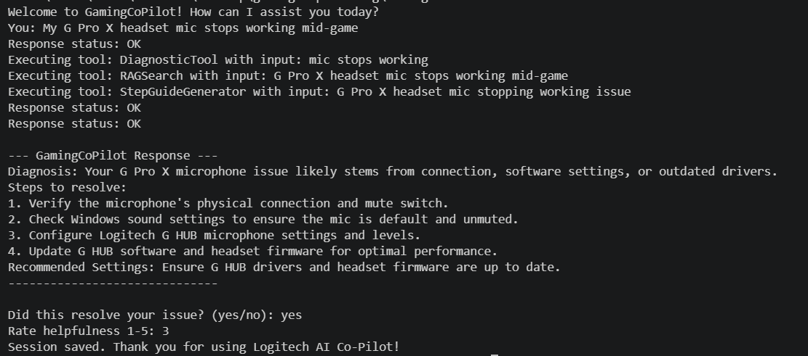

# AI Gaming Co-Pilot

> An autonomous AI agent that diagnoses gaming device issues,
> retrieves solutions from real documentation, and guides users step-by-step
> until the problem is solved.

## Demo Scenario

User types: "My G Pro X headset mic stops working mid-game"

Agent flow:
1. Planner calls LLM → decides tools: RAGSearch + DiagnosticTool + StepGuideGenerator
2. RAGSearchTool searches ChromaDB → finds headset mic troubleshooting docs
3. DiagnosticTool matches "mic not working" → "Mic Mute active or driver issue"
4. StepGuideGenerator → LLM generates 6-step fix guide
5. Agent presents diagnosis + steps + asks if resolved
6. If no → re-plans with new context

## Tech Stack

| Layer | Technology |
|-------|-----------|
| Agent Core | C# .NET 8 |
| RAG Service | Python FastAPI |
| Vector DB | ChromaDB |
| Embeddings | sentence-transformers |
| LLM | Google Gemini API |
| Container | Docker + docker-compose |
| Tests | xUnit (15 tests passing) |

## Architecture

```
User Input
    ↓
AgentLoop (C# .NET 8)
    ↓
Planner → LLM → ToolPlan JSON
    ↓
Executor runs tools in sequence:
┌─────────────────────────────────────────────────┐
│ RAGSearchTool     → Python FastAPI → ChromaDB   │
│ DiagnosticTool    → Symptom dictionary          │
│ SettingsOptimizer → Game genre rules engine     │
│ StepGuideGenerator→ LLM generates fix steps    │
└─────────────────────────────────────────────────┘
    ↓
Final LLM call → Structured AgentResponse
    ↓
Console Output + Session logged to JSON
```

## Setup

### Prerequisites
- Python 3.10+
- .NET 8 SDK
- Google Gemini API key (free at aistudio.google.com)

### Run Locally
```bash
# Terminal 1 - RAG Service
cd gaming-copilot-rag
pip install -r requirements.txt
uvicorn main:app --port 8000

# Terminal 2 - Agent
cd GamingCoPilot
set GEMINI_API_KEY=your-key
set RAG_SERVICE_URL=http://localhost:8000
dotnet run
```

### Run with Docker
```bash
cp .env.example .env
# Add your GEMINI_API_KEY to .env
docker-compose up
```

## Why This Is Not a Chatbot

- Plans before acting — LLM decides which tools to call based on the problem
- Uses real company's documentation via RAG, not just training data
- Loops and re-plans if the issue is not resolved after first attempt
- Logs every session with user feedback rating to JSON

## Test Results
15/15 unit tests passing across:
- DiagnosticToolTests
- SettingsOptimizerTests
- AgentMemoryTests
- ToolRegistryTests


## Future Scope
- Integration with Logitech G HUB API for real device telemetry
- Voice input support
- Mobile companion app
- Proactive device health alerts
- Multi-device simultaneous troubleshooting
